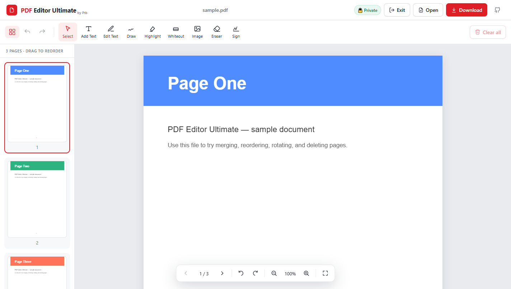

<div align="center">

# 📄 PDFly

### Free, private, in-browser PDF editor

Merge, reorder, rotate, and delete PDF pages — then download the result.
**Everything runs in your browser. Your files never leave your device.**

[](LICENSE)


[**Live demo**](#-live-demo) · [Features](#-features) · [Quick start](#-quick-start) · [Roadmap](#-roadmap) · [Contributing](#-contributing)

</div>

---

## Why PDFly?

Most "free" online PDF tools make you **upload your documents to a stranger's
server** — contracts, IDs, medical records, bank statements. PDFly does the same
everyday PDF jobs, but the file is opened, edited, and saved **entirely on your
own machine**. Nothing is uploaded, tracked, or stored. Close the tab and it's gone.

That makes it genuinely useful for anyone who needs to touch a sensitive PDF and
doesn't want to pay for Acrobat or trust a random website.

## ✨ Features

**Pages**
- 📂 **Open any PDF** — drag & drop or browse
- 🔗 **Merge** multiple PDFs into one (just add more files)
- 🔀 **Reorder** pages — drag thumbnails or move up / down
- 🔄 **Rotate** pages individually or all at once
- 🗑️ **Delete / extract** pages

**Edit & annotate**
- ✍️ **Add text** — with live font, **bold/italic**, size, and colour controls
- ✏️ **Edit existing text** — click a line to replace it, keeping the original font, size & colour
- 🖊️ **Draw & sign** freehand · 🖍️ **highlight** · ⬜ **whiteout / redact**
- 🖼️ **Insert images** — move & resize (aspect-locked)
- ✒️ **E-signatures** — draw or type a signature, save it on your device, stamp it anywhere
- 🧾 **Fill PDF forms** — text fields, checkboxes, radios, dropdowns (flattened on export)

**Workflow**
- ↩️ **Undo / redo** (Ctrl+Z / Ctrl+Shift+Z) · 🔍 zoom · ⌨️ keyboard page nav
- 💾 **Download** the edited PDF in one click
- 🔒 **100% client-side** — no uploads, no accounts, no tracking
- ⚡ Works **offline** once loaded

## 🚀 Live demo

**→ [mahbub-alam-prithibi.github.io/pdfly](https://mahbub-alam-prithibi.github.io/pdfly/)**



## 🧑‍💻 Quick start

```bash
# clone
git clone https://github.com/mahbub-alam-prithibi/pdfly.git
cd pdfly

# install
npm install

# run the dev server (http://localhost:5173)
npm run dev
```

Optional — generate a sample PDF to play with:

```bash
npm run make-sample   # writes public/sample.pdf
```

Build for production:

```bash
npm run build         # output in dist/
npm run preview       # preview the production build
```

## 🛠️ Tech stack

| Purpose        | Library                                                        |
| -------------- | ------------------------------------------------------------- |
| PDF rendering  | [pdf.js](https://github.com/mozilla/pdf.js) (`pdfjs-dist`)     |
| PDF editing    | [pdf-lib](https://github.com/Hopding/pdf-lib)                 |
| UI             | [React 18](https://react.dev)                                 |
| Build / dev    | [Vite 6](https://vitejs.dev) + TypeScript                     |

No backend. No database. No analytics. Just static files.

## ☁️ Deployment

Because it's fully static, you can host the `dist/` folder anywhere for free.

- **GitHub Pages** — a workflow is included at
  [`.github/workflows/deploy.yml`](.github/workflows/deploy.yml). Push to `main`,
  then enable **Settings → Pages → Source: GitHub Actions**.
- **Vercel / Netlify / Cloudflare Pages** — import the repo; build command
  `npm run build`, output directory `dist`.

## 🗺️ Roadmap

Good first contributions welcome! See [issues](../../issues).

- [ ] Drag-to-reorder thumbnails
- [ ] Add text & signatures (draw / type)
- [ ] Insert images onto pages
- [ ] Extract selected pages to a new file
- [ ] Password-protect / decrypt PDFs
- [ ] Compress / optimize file size
- [ ] Fill PDF form fields
- [ ] Light theme

## 🤝 Contributing

Contributions are very welcome — this is a friendly project to start open source
with. See [CONTRIBUTING.md](CONTRIBUTING.md). In short: fork, branch, `npm run dev`,
make your change, open a PR.

## 📜 License

[MIT](LICENSE) © 2026 Mahbub Alam Prithibi

---

<div align="center">
If PDFly helps you, please ⭐ the repo — it helps others find it.
</div>
